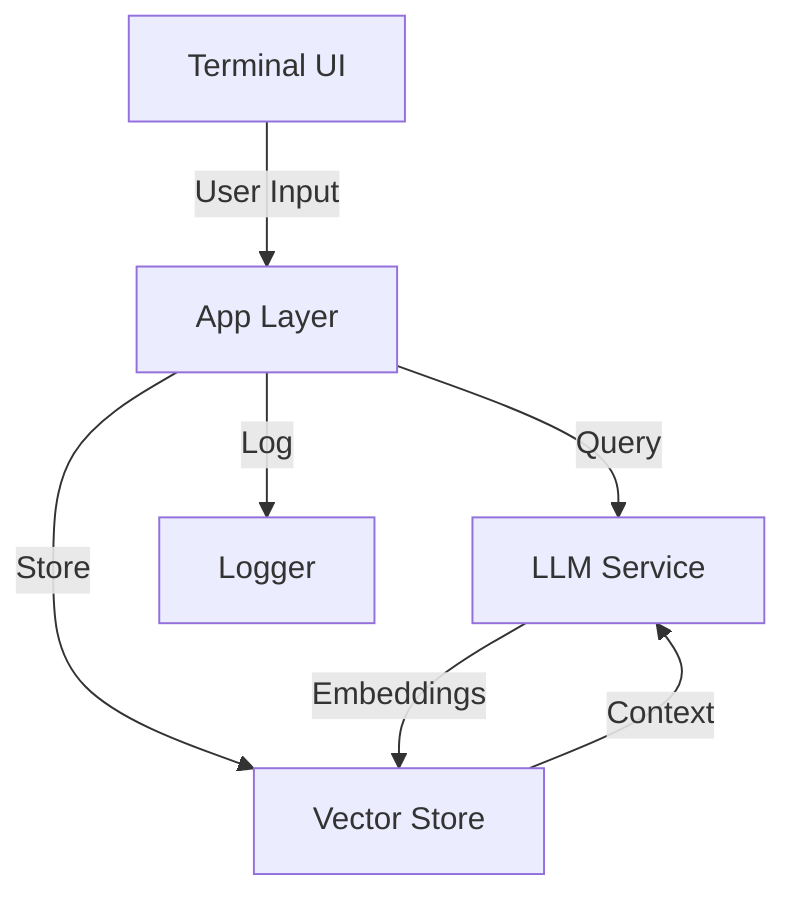

# AskAI - Go-based Terminal AI Assistant

[](https://goreportcard.com/report/github.com/VarunSharma3520/AskAI)
[](https://opensource.org/licenses/MIT)
[](https://pkg.go.dev/github.com/VarunSharma3520/AskAI)

## 🚀 Purpose / Developer Intent

AskAI is a blazing-fast, privacy-focused AI assistant built with Go, designed for developers who live in their terminal. As an avid nvim + tmux user, I created AskAI to:

- Get AI-powered assistance without ever leaving the terminal
- Maintain complete privacy with local-first architecture
- Eliminate context switching between terminal and browser
- Keep full control over data and queries
- Deliver a snappy, responsive experience with Go's performance
- Keep it 100% free and open-source

## ✨ Key Features

- 🚀 **Blazing Fast** - Built with Go for maximum performance
- 🔒 **Privacy First** - Your data stays on your machine
- ⚡ **Terminal-Native** - Seamless tmux and nvim integration
- 🤖 **AI-Powered** - Context-aware responses and code assistance
- 📚 **Knowledge Base** - Local vector store for Q&A history
- 🛠️ **Extensible** - Modular architecture for custom integrations
- 🔑 **API-Agnostic** - Works with any compatible AI provider

## Getting Started

### Prerequisites
- Go 1.21+
- tmux (recommended for best experience)
- nvim (optional, for editor integration)

### Installation
```bash
# Clone the repository
git clone https://github.com/yourusername/AskAI.git
cd AskAI

# Install dependencies
go mod tidy
```

## 🖥️ Usage

### Basic Usage

```bash
# Start the TUI interface
askai

# Or ask a question directly
askai "How do I reverse a slice in Go?"
```

### Keybindings

- `Enter`: Submit question
- `Ctrl+C`: Exit
- `Tab`: Toggle between input and options
- `↑/↓`: Navigate history/options
- `Esc`: Cancel current operation

### Nvim Integration

Add this to your `init.vim`:

```vim
" AskAI integration
function! AskAIContext()
  let filepath = expand('%:p')
  let cmd = 'askai --context ' . shellescape(filepath) . ' '
  call term_start('bash -c "' . cmd . '"', {'term_finish': 'close'})
endfunction

nmap <leader>ai :call AskAIContext()<CR>
```

## 🛠 Development

### Project Structure

```
.
├── cmd/              # Main application entry points
├── internal/         # Private application code
│   ├── app/         # Core application logic
│   ├── config/      # Configuration management
│   ├── db/          # Database interactions
│   ├── fs/          # Filesystem operations
│   ├── llm/         # Language model integrations
│   ├── logger/      # Logging utilities
│   ├── types/       # Shared data types
│   ├── ui/          # Terminal user interface
│   └── vector/      # Vector store operations
└── pkg/             # Public packages (if any)
```

### Running Tests

```bash
# Run all tests
go test ./...

# Run with coverage
go test -coverprofile=coverage.out ./...
go tool cover -html=coverage.out
```

### Contributing

1. Fork the repository
2. Create a feature branch (`git checkout -b feature/amazing-feature`)
3. Commit your changes (`git commit -m 'Add some amazing feature'`)
4. Push to the branch (`git push origin feature/amazing-feature`)
5. Open a Pull Request

Please follow the [Go Code Review Comments](https://github.com/golang/go/wiki/CodeReviewComments) for style guidelines.

## 🏗 Architecture

AskAI is built with a clean, modular architecture following Go best practices:



### Key Components

1. **Terminal UI**
   - Built with [Bubble Tea](https://github.com/charmbracelet/bubbletea)
   - Responsive and keyboard-driven
   - Real-time streaming responses

2. **Vector Store**
   - Uses Qdrant for efficient similarity search
   - Stores document embeddings and metadata
   - Enables context-aware responses

3. **LLM Integration**
   - Supports multiple model backends
   - Handles streaming responses
   - Manages API keys and authentication

4. **Configuration**
   - Environment-based configuration
   - Sensible defaults with easy overrides
   - Automatic config file generation

## ⚙️ Configuration

Create a `.env` file in your home directory or project root:

```bash
# Required
OLLAMA_URL=http://localhost:11434  # Ollama server URL
QDRANT_URL=localhost:6334          # Qdrant server URL

# Optional
MODEL_NAME=mistral                 # Default model to use
TEMPERATURE=0.7                    # Model temperature (0.0 to 1.0)
VAULT_PATH=~/.askai                # Path to store local data
LOG_LEVEL=info                     # Logging level (debug, info, warn, error)
```

### Environment Variables

| Variable      | Default           | Description                          |
|---------------|-------------------|--------------------------------------|
| `OLLAMA_URL`  | `http://localhost:11434` | URL of the Ollama server      |
| `QDRANT_URL`  | `localhost:6334`  | Qdrant server address and port       |
| `MODEL_NAME`  | `mistral`         | Default model to use                 |
| `VAULT_PATH`  | `~/.askai`        | Path for storing local data          |
| `LOG_LEVEL`   | `info`            | Logging verbosity level              |

## 🎯 Why Go + Terminal?

1. **Performance**
   - Compiled binary means instant startup
   - Low memory footprint
   - Efficient concurrency model

2. **Portability**
   - Single binary deployment
   - Cross-platform support
   - No runtime dependencies

3. **Terminal Integration**
   - Native TTY handling
   - Seamless tmux integration
   - Perfect for remote development

4. **Developer Experience**
   - Strong typing catches errors early
   - Excellent tooling (gofmt, goimports, staticcheck)
   - Great standard library

5. **Privacy & Control**
   - Your data stays on your machine
   - No telemetry or data collection
   - Full control over model and storage

## 🚨 Troubleshooting

### Common Issues

**Q: Error connecting to Ollama**
```
Failed to connect to Ollama at http://localhost:11434
```
**Solution**: Make sure Ollama is running:
```bash
ollama serve  # In a separate terminal
```

**Q: Qdrant connection refused**
```
Failed to create Qdrant client: connection error
```
**Solution**: Start Qdrant:
```bash
docker run -p 6333:6333 -p 6334:6334 qdrant/qdrant
```

**Q: Missing dependencies**
```
go: module not found
```
**Solution**: Download dependencies:
```bash
go mod tidy
```

### Getting Help

- Check the [Issues](https://github.com/VarunSharma3520/AskAI/issues) page
- For bugs, please include:
  - `askai --version`
  - Steps to reproduce
  - Relevant error logs from `~/.askai/askai.log`

## 📜 License

MIT © [Varun Sharma](https://github.com/VarunSharma3520)

## 🙏 Acknowledgments

- [Bubble Tea](https://github.com/charmbracelet/bubbletea) for the amazing TUI framework
- [Ollama](https://ollama.ai/) for making local LLMs accessible
- [Qdrant](https://qdrant.tech/) for the powerful vector database
- All contributors and users of AskAI

---

Built with ❤️ in Go. Happy coding in your terminal! 🚀